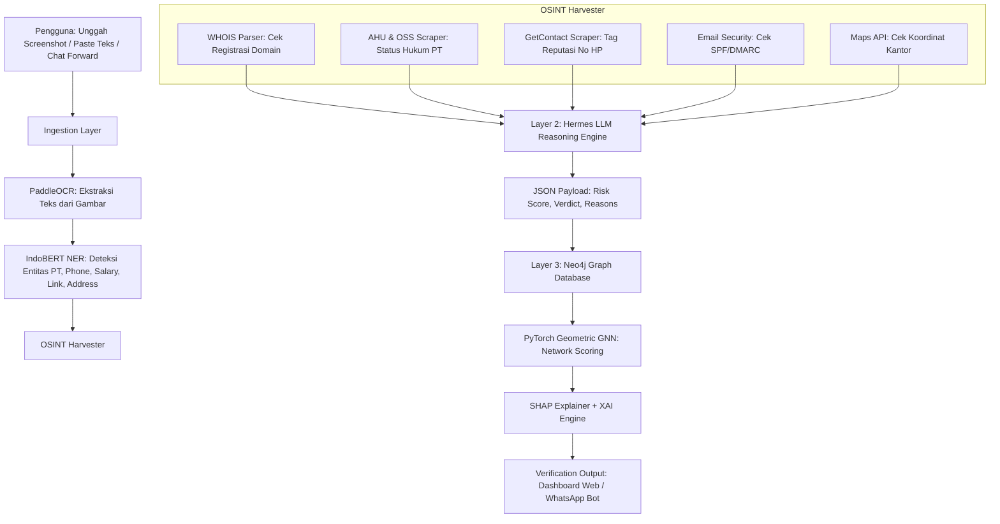

# Proposal & Arsitektur Sistem: "Verifin" — Platform Verifikasi Lowongan Kerja Berbasis Heterogeneous Graph, OCR, dan Explainable AI

Dokumen ini berisi rancangan lengkap, arsitektur sistem, dan rencana riset teknologi untuk platform **Verifin** (sistem verifikasi keaslian lowongan pekerjaan dan identitas perusahaan penerbit). Dokumen ini dibedah menggunakan **Sistem CCA + Step 0** sesuai dengan pedoman riset [framework-problem-solver.md](file:///Users/matthewpriantara/Documents/Code/competition_project/gemastik26/gemastik19/riset/strategi/framework-problem-solver.md).

---

## 1. Analisis Kelayakan & Relevansi OSINT

Menggunakan **OSINT (Open Source Intelligence)** untuk memverifikasi keaslian lowongan kerja dan perusahaan sangat **sangat memungkinkan, relevan, dan efisien**. 

### Mengapa OSINT Sangat Efektif untuk Kasus Ini?
Penipuan lowongan kerja (*job scam*) di Indonesia—yang kini menjadi pintu masuk utama Tindak Pidana Perdagangan Orang (TPPO) siber transnasional—umumnya memiliki pola digital footprint yang konsisten dan bisa dideteksi secara publik:
1.  **Penggunaan Domain Palsu/Baru:** Penipu sering membuat situs tiruan (misal `recruitment-pertamina-tbk.com` padahal domain resmi `pertamina.com`) yang baru didaftarkan beberapa hari/minggu lalu. WHOIS OSINT dapat mendeteksi tanggal registrasi domain ini.
2.  **Identitas Perusahaan Fiktif:** Penipu sering mencatut nama PT yang tidak terdaftar di database Kemenkumham atau menggunakan alamat kantor fiktif (ruko kosong, lahan kosong) yang dapat diverifikasi via koordinat GPS.
3.  **Reputasi Kontak Penipu:** Korban diminta mentransfer uang ke agen travel tertentu untuk akomodasi wawancara palsu. Nomor rekening atau nomor WhatsApp penipu sering kali memiliki reputasi buruk di database GetContact/Truecaller.

### Celah Penelitian Terdahulu (Research Gap)
Metodologi deteksi lowongan palsu terdahulu (seperti model LSTM atau Random Forest tradisional) hanya menganalisis teks secara terisolasi. Mereka mengabaikan relasi jaringan pelaku penipuan yang kerap menggunakan entitas berulang (seperti nomor telepon, alamat, atau nama perusahaan fiktif) di berbagai platform. **Verifin mengisi celah ini dengan mengintegrasikan Heterogeneous Graph Neural Network dan OSINT secara dinamis.**

---

## 2. Pemilihan Model & Pustaka AI (Hybrid-Incremental Stack)

Untuk mencapai latensi rendah, biaya murah, dan performa *deep engineering* yang tinggi, Verifin menggunakan pendekatan tumpukan AI hibrida bertingkat:

*   **OCR Engine:** **PaddleOCR** (lokal) dipilih karena memiliki akurasi ekstraksi teks yang sangat tinggi pada gambar tangkapan layar obrolan WhatsApp/Telegram atau pamflet digital berbahasa Indonesia.
*   **Layer 1 (Entity Extraction):** **IndoBERT NER (110M)**. Model NLP kecil yang di-*fine-tune* secara lokal (menggunakan model dasar seperti `indobenchmark/indobert-base-p1` atau model Hugging Face siap pakai seperti `w11wo/indobert-jakarta-ner`) untuk mengekstrak entitas Nama Perusahaan, Gaji, Nomor Telepon, Alamat, dan Tautan.
*   **Layer 2 (Reasoning LLM):** **Nous-Hermes-2-Pro-Llama-3-8B** atau **OpenHermes-2.5-Mistral-7B** (lokal via Ollama/vLLM). Model 7B-8B ini di-*fine-tune* menggunakan **Unsloth (QLoRA)** di Google Colab untuk menerima payload OSINT dan menghasilkan laporan analisis forensik berformat JSON terstruktur secara instan. GPT-4o-mini digunakan sebagai *API fallback* untuk wilayah abu-abu.
*   **Layer 3 (Graph Database & GNN):** **Neo4j** sebagai database graf utama + **PyTorch Geometric (PyG)** untuk Graph Neural Network untuk melacak relasi dan menyebarkan skor risiko jaringan (*Network Risk Propagation*).
*   **Explainable AI (XAI):** **SHAP (SHapley Additive exPlanations)** untuk menghitung kontribusi fitur numerik, kemudian diterjemahkan oleh LLM Hermes menjadi teks deskriptif yang ramah pengguna.

---

## 3. Bedah Ide Menggunakan Sistem CCA + Step 0

### A. STEP 0: Challenge the Goal (Dekonstruksi Tujuan)
*   *Tujuan Awal:* Membuat database manual berisi daftar lowongan kerja palsu (tidak efektif karena sindikat berganti nama dan disebarkan dalam hitungan jam).
*   *Tujuan Akhir Sebenarnya:* Memberikan **verifikasi keaslian seketika (*real-time trust validation*)** dari suatu penawaran kerja langsung di tangan pengguna sebelum mereka menyerahkan data pribadi/finansial, serta memetakan jaringan sindikat penipuan yang terorganisasi secara proaktif.
*   *Radical Shortcut:* 
    1. Jangan latih LLM untuk tugas ekstraksi teks/entitas dasar (tugas ini didelegasikan ke IndoBERT NER lokal yang murah dan cepat).
    2. Gunakan LLM lokal (Hermes) sebagai *Reasoning Engine* berbasis payload OSINT deterministik.
    3. Manfaatkan Neo4j untuk "pelatihan dinamis" relasional. Semakin banyak laporan user yang masuk, semakin pintar sistem dalam mendeteksi sindikat berulang secara otomatis tanpa melatih ulang neural network.

### B. CERDAS (First-Principles Thinking)
*   *Variabel Fundamental Kepercayaan Perusahaan:* 
    *   **Legalitas:** Terdaftar resmi di Ditjen AHU Kemenkumham / OSS / BP2MI.
    *   **Komunikasi:** Domain email pengirim terverifikasi (lulus SPF/DMARC) dan bukan email gratisan atau domain baru (< 90 hari).
    *   **Fisik:** Alamat kantor tidak berada di lahan kosong/ruko fiktif.
    *   **Relasi Jaringan:** Entitas (nomor HP/PT) tidak terhubung dengan kluster penipuan yang sudah dilaporkan sebelumnya di database graf.
*   *Kausalitas Fraud:* Jika domain email baru dibuat < 30 hari, nama PT tidak terdaftar, dan nomor kontak memiliki tag penipuan di GetContact, maka probabilitas kebohongan (*fraud probability*) mendekati 99.9%.

### C. CERAH (Peta Realitas Taktis)
*   *Bypass API Mahal:* Gunakan *Automated Scraping* dan *Local DB Copy* (salinan lokal data kementerian yang di-update berkala) sebagai *fallback* untuk menghindari proteksi CAPTCHA dan latensi API kementerian.
*   *Cold Start Mitigation:* Tim memprogram *Job Portal Scraper Agent* untuk memanen minimal 1.000 data lowongan kerja liar di media sosial sebagai *Seed Data* sebelum demo, serta menyuntikkan data nomor telepon penipu dari basis data aduan publik resmi (aduannomor.id).
*   *Latensi SHAP:* Kalkulasi SHAP dibatasi pada model klasifikasi tingkat 1 (IndoBERT lokal) agar latensi tetap di bawah 1 detik, lalu diubah menjadi teks naratif oleh Hermes.

### D. ASIK (Integritas sebagai Multiplier)
*   *Privasi Pengguna:* Data sensitif pengguna (seperti nomor telepon pelapor) disamarkan secara lokal menggunakan enkripsi satu arah (SHA-256) sebelum dimasukkan ke database graf.
*   *Transparansi:* Platform menyajikan visualisasi graf Neo4j 2D dan bagan penjelasan kontribusi fitur (SHAP) dalam bahasa manusia yang jujur dan transparan untuk membangun *trust* ekosistem.

---

## 4. Arsitektur Sistem Verifin

Berikut adalah arsitektur aliran data sistem dari input pengguna hingga output tingkat kepercayaan:



---

## 5. Rincian Aliran Kerja & Komponen Arsitektur

### 1. Ingestion & Parsing Layer
*   **Input:** File gambar tangkapan layar lowongan/chat, teks deskripsi lowongan, file `.eml`, atau nomor telepon/tautan mencurigakan.
*   **Touchpoints (Media Akses):**
    *   **Web App (Next.js 16 TS):** Portal utama untuk unggah berkas, visualisasi graf Neo4j 2D (Vis.js/D3.js), dan detail SHAP.
    *   **WhatsApp Bot:** Pengguna cukup melakukan *forward* chat loker/screenshot untuk mendapatkan analisis instan secara *real-time*.
*   **Proses Parsing:**
    *   Menggunakan **PaddleOCR** untuk membaca gambar.
    *   Menggunakan **IndoBERT NER** untuk mengekstrak entitas kunci seperti Nama Perusahaan (`COMPANY`), Nominal Gaji (`SALARY`), Nomor Telepon (`CONTACT`), Alamat (`ADDRESS`), dan Tautan (`URL`).

### 2. OSINT Research Hub (Investigasi Otomatis)
*   **WHOIS Domain Checker:** Mengecek tanggal registrasi domain email pengirim. Jika umur domain < 90 hari, diberikan label *suspicious*.
*   **AHU Kemenkumham & OSS Scraper:** Memeriksa status hukum perusahaan. Menggunakan *local database copy* sebagai *fallback tercepat*.
*   **GetContact Scraper:** Memeriksa tag nama pada nomor kontak WhatsApp pengirim loker untuk melihat reputasi (apakah ditandai sebagai penipu).
*   **Email Security Parser:** Menganalisis header SPF/DMARC pada email pengirim untuk mendeteksi *phishing*/*impersonation*.
*   **Maps API Location Verifier:** Mengecek alamat kantor yang dicantumkan untuk menganalisis anomali geografis.

### 3. Layer 2: Reasoning LLM (Hermes)
*   **Model:** Nous-Hermes-2-Pro-Llama-3-8B (lokal) atau GPT-4o-mini (API fallback).
*   **Alur:** LLM menerima gabungan teks mentah lowongan + payload hasil investigasi OSINT. LLM bertindak sebagai analis forensik untuk menilai risiko dan mengeluarkan output JSON terstruktur:
    ```json
    {
      "risk_score": 98,
      "verdict": "BAHAYA",
      "reasons": ["Domain baru dibuat 5 hari lalu", "PT tidak terdaftar di AHU"],
      "explainable_ai": "Terjadi kombinasi fatal dari domain email baru dan ketiadaan badan hukum PT."
    }
    ```

### 4. Layer 3: Neo4j Graph Database & PyG GNN
*   **Skema Graf:** Menggunakan simpul (Node) `User`, `Lowongan`, `Perusahaan`, `Telepon`, `Alamat`, dan `Tautan` dengan relasi seperti `MELAPORKAN`, `MENGGUNAKAN_KONTAK`, dan `BERALAMAT_DI`.
*   **Proses:** Memasukkan entitas hasil ekstraksi ke Neo4j. Model GNN berbasis **PyTorch Geometric (PyG)** menyebarkan skor risiko relasional melalui jaringan untuk mendeteksi sindikat penipuan berulang.

### 5. Autonomous Agent Layer (LangChain + Playwright + Celery)
*   **Agent 1: Job Portal Scraper:** Scrape lowongan dari JobStreet/LinkedIn secara berkala untuk memanen dataset dan mendeteksi tren penipuan baru.
*   **Agent 2: WA/Telegram Monitor:** Memantau grup obrolan loker publik secara pasif untuk mendeteksi penyebaran kampanye *scam*.
*   **Agent 3: Government DB Sync:** Melakukan sinkronisasi database lokal berkala dengan data AHU/OSS/BP2MI.
*   **Agent 4: Pattern Hunter:** Melakukan deteksi anomali (Clustering DBSCAN) jika ada lonjakan pelaporan entitas tertentu.
*   **Agent 5: Competitor Watch:** Sinkronisasi silang dengan data publik platform seperti aduannomor.id atau CekRekening.

---

## 6. Langkah-Langkah Riset & Implementasi Strategis (2-Sprint Scrum)

### Sprint 1: Core Engine, AI MVP, & Graph Database (Hari 1–7)
1.  **Setup Environment:** Konfigurasi database PostgreSQL, Neo4j, dan Redis di Docker.
2.  **Pipeline Ingestion:** Integrasikan PaddleOCR dan fine-tuning/setup model IndoBERT NER untuk ekstraksi entitas.
3.  **OSINT Harvester:** Tulis modul Python untuk WHOIS, GetContact API, dan SPF/DMARC checker.
4.  **Reasoning & Graph Ingestion:** Konfigurasi prompt local LLM Hermes (Unsloth QLoRA) untuk format JSON, dan tulis Cypher query asinkron untuk memasukkan data ke Neo4j.

### Sprint 2: UI Integration & Field Testing (Hari 8–14)
1.  **Web & Bot App:** Bangun antarmuka Next.js terintegrasi visualisasi graf Neo4j 2D (Vis.js) dan bagan SHAP. Rancang WhatsApp Bot menggunakan API Gateway.
2.  **Agent Deployment:** Luncurkan 5 Autonomous Agents menggunakan Celery scheduler untuk scraping dan pembaruan database.
3.  **UAT & SUS Testing:** Lakukan uji coba kegunaan (System Usability Scale) kepada minimal 20 pencari kerja fresh graduates untuk validasi lapangan.
4.  **Deployment & Final Tuning:** Deploy sistem menggunakan Docker di VPS Cloud terenkripsi.

---

## 7. Strategi Sukses Gemastik XIX (Divisi PPL)

Untuk memenangkan kompetisi nasional, tim Check IN menerapkan strategi berikut:
1.  **Deep Engineering Berdampak Tinggi:** Integrasi model NLP lokal (IndoBERT), detektif OSINT, graf Neo4j dinamis, dan SHAP XAI membuktikan sistem ini bukan sekadar *API wrapper* sederhana.
2.  **Prototipe Integrasi Fisik (Jangka Panjang):** Merancang rencana pembuatan **Verifin Kiosk (Kios Mandiri Tenaga Kerja)** berbasis *Raspberry Pi* layar sentuh untuk dipasang di kantor Disnaker/desa sebagai wujud integrasi fisik yang disukai juri Gemastik PPL.
3.  **Kemitraan Nyata:** Menyusun draf kolaborasi (*Letter of Collaboration*) dengan **UGM Career Center** untuk menempatkan Verifin sebagai penyaring utama loker yang masuk ke portal kampus.
