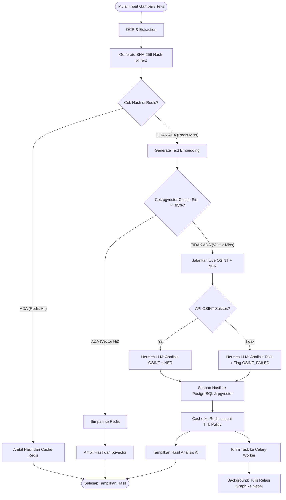

# Product Requirement Document (PRD)
# Verifin — Sistem Deteksi & Verifikasi Penipuan Lowongan Kerja Berbasis AI

**Tim:** Check IN — Universitas Gadjah Mada
**Kompetisi:** GEMASTIK XIX (2026) — Divisi Pengembangan Perangkat Lunak
**Versi Dokumen:** v2.0 (Backend-Focused)
**Status:** Approved / Reference

---

## Daftar Isi

1. Pendahuluan
2. Ringkasan Produk
3. Tujuan & Sasaran Proyek
4. Ruang Lingkup (Scope)
5. Persona Pengguna & User Stories
6. Arsitektur Sistem
7. Spesifikasi Fungsional — Backend & AI Engine
8. Spesifikasi Fungsional — Website (Frontend)
9. Skema Data & Kontrak API
10. Zero-Cost Technology Stack
11. Non-Functional Requirements
12. Keamanan & Privasi Data
13. Metrik Keberhasilan & Kriteria Evaluasi
14. Roadmap & Milestone Pengembangan
15. Risiko & Mitigasi
16. Lampiran

---

## 1. Pendahuluan

### 1.1 Latar Belakang
Sistem Verifin v2 dirancang sebagai mesin deteksi penipuan lowongan kerja (*anti-fraud detection engine*) di Indonesia yang cerdas, cepat, dan sepenuhnya bebas biaya operasional model (*zero operational cost*). 

### 1.2 Tujuan Dokumen
PRD ini bertujuan untuk merumuskan spesifikasi sistem yang menyeimbangkan antara performa responsif bagi pengguna akhir dan efisiensi pemakaian memori/komputasi AI lokal.

### 1.3 Definisi & Istilah
*   **Case Memory**: Sistem penyimpanan bertingkat yang mengingat data loker yang sudah pernah diproses agar tidak perlu melakukan analisis AI ulang untuk input yang sama/mirip.
*   **pgvector**: Ekstensi PostgreSQL untuk menyimpan dan mencari kemiripan representasi vektor (embedding) menggunakan metrik *Cosine Distance*.
*   **Ollama / Hermes3**: Engine model bahasa besar (LLM) lokal yang digunakan untuk melakukan penalaran vonis tanpa biaya API berbayar.
*   **OSINT**: *Open Source Intelligence*, pencarian informasi berbasis sumber terbuka secara gratis (seperti peta OpenStreetMap, status WHOIS, dan catatan DNS).
*   **Sindikat**: Pola hubungan antarentitas fiktif (seperti nomor telepon atau alamat email penipu yang sama) yang terhubung ke beberapa postingan loker berbeda pada Neo4j.

---

## 2. Ringkasan Produk

### 2.1 Pernyataan Masalah (Problem Statement)
Pencari kerja pemula (*fresh graduates*) di Indonesia sering menghadapi ancaman penipuan lowongan kerja fiktif yang meminta uang administrasi atau menyalahgunakan data pribadi. Mereka kesulitan memvalidasi keabsahan lowongan secara cepat karena keterbatasan akses ke basis data resmi (seperti Kemenkumham) dan ketidakpahaman atas metode penyelidikan data (OSINT).

### 2.2 Solusi
Verifin menawarkan portal web sederhana di mana pengguna cukup mengunggah tangkapan layar brosur loker atau menempelkan teksnya secara langsung. Sistem akan secara otomatis melakukan ekstraksi teks (OCR), mengumpulkan data pendukung secara gratis (OSINT), dan menganalisis polanya menggunakan AI lokal untuk menampilkan status vonis serta visualisasi jaringan sindikat secara instan.

### 2.3 Proposisi Nilai (Value Proposition)
*   **Kecepatan Respon Tinggi**: Waktu verifikasi kurang dari 100 ms untuk data yang sudah tersimpan di memori kasus (*Case Memory*).
*   **Bebas Biaya Operasional**: Seluruh pemrosesan (OCR, NER, Embeddings, LLM) berjalan secara lokal, menjamin kelangsungan aplikasi tanpa beban biaya API.
*   **Kejelasan Analisis**: Memberikan alasan penarikan keputusan AI yang transparan dan memetakan jaringan penipu dalam bentuk visual grafis yang intuitif.

### 2.4 Diferensiator terhadap Solusi Sejenis
*   Menggunakan basis data grafis (**Neo4j**) untuk mendeteksi relasi sindikat lintas postingan, bukan hanya melakukan analisis teks mandiri per-kasus.
*   Menggabungkan sistem pencarian bertingkat (SHA-256 Exact match dan `pgvector` Semantic match) untuk menghemat daya komputasi server lokal secara signifikan.

---

## 3. Tujuan & Sasaran Proyek

### 3.1 Tujuan Utama Proyek (Core Objectives)
1. **Optimalisasi Kecepatan Pengguna (Minimal UX Latency):**
   * **Target SLA untuk Cache Hit (Level 1 & 2):** Respon verifikasi harus kembali ke pengguna dalam waktu **$< 100\text{ ms}$** (menggunakan pencarian hash Redis dan pencarian semantik `pgvector`).
   * **Target SLA untuk Cache Miss (Level 3):** Proses penarikan data OSINT dan inferensi LLM lokal harus selesai dalam waktu **$< 15\text{ detik}$**.
2. **Efisiensi Komputasi & Token Lokal (Compute Efficiency):**
   * Menghindari kelebihan beban (*overhead*) pada CPU/GPU server lokal akibat pemanggilan LLM berulang untuk brosur penipuan yang sama (sindikat penipu biasanya menyebarkan satu gambar/teks secara masif ke ribuan korban).
   * Melalui *Case Memory*, jika suatu pola loker sudah pernah dianalisis sekali, sistem tidak perlu memanggil LLM lagi untuk permintaan berikutnya yang memiliki kemiripan makna.
3. **Bebas Biaya Operasional (Strict Zero-Cost Constraints):**
   * Seluruh komponen sistem wajib menggunakan arsitektur gratis atau *open-source* yang dapat di-host secara lokal tanpa ketergantungan pada API berbayar (seperti OpenAI, Google Cloud Maps API, atau WHOIS berbayar).
4. **Struktur yang Terbuka & Ramah Pengembang (Dev & AI Readable):**
   * Kode dan skema data didokumentasikan secara ketat agar mudah dipahami oleh tim pengembang dan dapat dibaca oleh *AI coding assistant* untuk otomatisasi pemeliharaan sistem di masa mendatang.

### 3.2 Tujuan Tambahan (Cakupan Produk & Kompetisi)
*   **Demo-Readiness**: Menyediakan dataset seed (data taburan awal) yang representatif agar visualisasi jaringan sindikat graf Neo4j terlihat padat dan meyakinkan saat didemokan di depan juri GEMASTIK.
*   **Stabilitas Eksekusi**: Menghindari crash atau kehabisan memori (OOM) pada server lokal saat memproses permintaan konkuren dengan membatasi resolusi input dan menerapkan kunci thread pada model AI lokal.

### 3.3 Sasaran Terukur (Success Metrics)
*   **Akurasi Vonis**: Akurasi klasifikasi loker palsu mencapai $\ge 80\%$ pada pengujian dataset tertutup.
*   **Kecepatan Rata-rata**: Waktu penyelesaian rata-rata di bawah 10 detik untuk kasus baru, dan di bawah 100 ms untuk kasus serupa yang tersimpan di cache.
*   **Zero API Expense**: Biaya penggunaan API berbayar selama masa pengembangan dan penilaian bernilai $0$ Rupiah.

---

## 4. Ruang Lingkup (Scope)

### 4.1 Dalam Cakupan (In-Scope)
*   Input pencarian berupa unggahan file gambar (OCR) atau salin-tempel teks langsung.
*   Pemrosesan data multi-level (Redis SHA-256 $\rightarrow$ pgvector semantic $\rightarrow$ Live OSINT + LLM Hermes3).
*   Visualisasi graf interaktif (Vis.js) untuk melacak relasi nomor telepon, email, dan alamat perusahaan pelaku.
*   Penyimpanan riwayat pencarian pengguna secara lokal (*LocalStorage* pada browser pengguna).
*   Script penaburan data awal (*database seeding script*) berisi skenario sindikat fiktif untuk demo.
*   Manajemen fallback jika salah satu layanan OSINT gratis mengalami kendala koneksi.

### 4.2 Luar Cakupan (Out-of-Scope)
*   Sistem registrasi pengguna, login dengan password, serta OAuth pihak ketiga (Google/Facebook) guna menjaga kesederhanaan MVP utilitas pencarian.
*   Manajemen dasbor administrasi moderasi yang rumit (moderasi status laporan cukup dihandle via database secara langsung).
*   Modul scraping situs loker secara live (karena proteksi anti-scraping Cloudflare pada portal loker resmi, pengisian data hanya bersandar pada input mandiri dan mock seed data).

### 4.3 Kandidat Pengembangan Lanjutan
*   Ekstensi Google Chrome untuk mendeteksi keaslian lowongan kerja secara real-time langsung di browser.
*   Layanan bot interaktif WhatsApp / Telegram untuk memverifikasi isi lowongan via chat.

---

## 5. Persona Pengguna & User Stories

### 5.1 Persona
*   **Rian (21 tahun, Fresh Graduate)**: Sedang giat mencari lowongan kerja magang dan paruh waktu di internet. Memerlukan kepastian kilat apakah tawaran kerja yang diterimanya aman atau fiktif sebelum menyerahkan CV berisi data pribadinya.
*   **Ibu Minah (45 tahun, Orang Tua)**: Kurang memahami istilah AI/teknologi. Membutuhkan hasil pemeriksaan loker yang sederhana dengan warna indikator (Hijau/Kuning/Merah) yang jelas agar bisa langsung melarang anaknya jika loker tersebut berbahaya.

### 5.2 User Stories Utama
*   **US-01**: Sebagai pencari kerja, saya ingin mengunggah gambar poster loker agar sistem bisa membaca teks di dalamnya secara otomatis tanpa perlu saya ketik ulang.
*   **US-02**: Sebagai pencari kerja, saya ingin melihat rincian faktor risiko dalam bahasa Indonesia yang lugas agar mengerti mengapa loker tersebut dikategorikan sebagai penipuan.
*   **US-03**: Sebagai pengguna, saya ingin melihat riwayat loker yang pernah saya verifikasi sebelumnya di halaman riwayat tanpa perlu mendaftar akun terlebih dahulu.

---

## 6. Arsitektur Sistem

Sistem Verifin v2 menggunakan **Hybrid Architecture** yang terbagi menjadi dua lapisan utama untuk meminimalkan waktu tunggu pengguna (UX Latency) dan meminimalkan konsumsi daya/komputasi AI lokal (CPU/GPU local resource):

1. **Real-Time Layer (API & Inference):** Menangani *request* langsung dari pengguna secara cepat dengan memanfaatkan sistem pencarian bertingkat (*hierarchical lookup*):
   * **Level 1 (Exact Match):** Sidik jari teks (Hash SHA-256) dicocokkan di Redis.
   * **Level 2 (Semantic Match):** Kemiripan makna teks dicari menggunakan `pgvector` di PostgreSQL dengan *threshold* $\ge$ 95%.
   * **Level 3 (Fresh Inference):** Menjalankan *Live OSINT* dan *local LLM* (Hermes3 via Ollama) hanya jika data belum pernah dikenali oleh ingatan sistem (*Case Memory*).
2. **Background Layer (Asynchronous Processing):** Menjalankan pemrosesan asinkron di latar belakang menggunakan Celery Workers:
   * Menghubungkan relasi entitas baru ke dalam Graph Database (Neo4j).
   * Melakukan pemindaian berkala (*background scraping*) data loker publik untuk memperkaya *Knowledge Graph*.

### 6.1 Lapisan Real-Time
*[Tercakup dalam penjelasan umum Arsitektur Sistem di atas]*

### 6.2 Lapisan Background
*[Tercakup dalam penjelasan umum Arsitektur Sistem di atas]*

### 6.3 Diagram Alur Sistem (System Workflow Diagram)
Berikut adalah diagram alur keputusan dari awal pengunggahan berkas/teks oleh pengguna hingga keputusan akhir diberikan:



### 6.4 Arsitektur Tingkat Tinggi (High-Level Architecture)
Sistem dideploy menggunakan model arsitektur 3-Tier yang berjalan sepenuhnya di mesin lokal:
*   **Presentation Layer (Frontend)**: Halaman web statis menggunakan React & Tailwind CSS. Rendering visualisasi grafis jaringan dilakukan secara langsung di sisi client menggunakan pustaka Vis.js.
*   **Application Layer (Backend)**: Framework asinkron FastAPI (Python) yang mengekspos REST API dan mengatur jalannya pipa data (PaddleOCR, IndoBERT NER, OSINT check, dan integrasi LLM Ollama).
*   **Database Layer**: Terdiri dari Redis (In-memory exact cache), PostgreSQL + pgvector (Relational & Semantic database), dan Neo4j (Graph database).

### 6.5 Spesifikasi Logika Case Memory
Sistem mengingat kasus penipuan lama menggunakan pendekatan dua tingkat:

#### 1. Sidik Jari Teks (Exact Cache Match)
* **Logika:** Teks mentah hasil OCR atau masukan pengguna disanitasi dengan cara mengubah seluruh huruf menjadi huruf kecil (*lowercase*), menghapus spasi (*whitespace*), dan menghapus karakter baris baru (*newline*). Hasil sanitasi teks di-hash dengan algoritma **SHA-256** menjadi string 64-karakter sebagai kunci pencarian di Redis.
* **Keuntungan:** Kecepatan pencarian $< 2\text{ ms}$, langsung menghindari pemanggilan database relasional dan model AI.

#### 2. Pencarian Semantik Kasus (Semantic Case Search)
* **Logika:** Jika exact match gagal, teks loker diubah menjadi representasi vektor (384 dimensi) menggunakan model lokal **`paraphrase-multilingual-MiniLM-L12-v2`**. Query ini dijalankan ke PostgreSQL menggunakan indeks `pgvector` (misal HNSW) untuk mencari kecocokan dengan formula:
  $$\text{Cosine Distance} \le 0.05 \quad (\text{kemiripan } \ge 95\%)$$
* **Keuntungan:** Mendeteksi modifikasi minor yang umum dilakukan penipu (seperti hanya mengganti nomor telepon atau nama instansi pada teks deskripsi loker yang sama).

### 6.6 Strategi Manajemen Penyimpanan & Sinkronisasi
* **TTL Policy (Redis Cache):**
  * Kasus berstatus **BAHAYA** atau **WASPADA** disimpan secara **permanen (tanpa TTL)** karena sifat penipuan tidak pernah berubah.
  * Kasus berstatus **AMAN** diberi masa aktif (**TTL: 7 hari** / 168 jam) untuk mengantisipasi perubahan data lowongan resmi atau penutupan loker asli.
* **Neo4j Graph Database Writes:**
  * Penulisan relasi entitas ke Neo4j (Node: `Company`, `Phone`, `Email`, `Address`) dijalankan secara **asinkron** di antrean Celery.
  * API FastAPI langsung mengembalikan respon ke pengguna tanpa harus menunggu penyelesaian query graph, menjaga waktu respon di tingkat *user* tetap minimal.
* **Kebijakan Soft Fallback OSINT:**
  * Jika API Nominatim (OpenStreetMap) atau WHOIS mengalami gangguan jaringan, sistem tidak menghentikan proses.
  * Masukan dikirim ke LLM dengan flag `osint_failed=True`. LLM dipaksa memberikan analisis heuristik murni berbasis pola bahasa loker, dibarengi catatan transparansi sistem untuk pengguna.

---

## 7. Spesifikasi Fungsional — Backend & AI Engine

### 7.A Pipeline Pemrosesan Berkas & Teks
1. **OCR Engine (PaddleOCR PP-OCRv6):**
   * Menerima input berkas gambar (JPEG/PNG/WEBP, maks 20MB).
   * Melakukan pengecekan resolusi: Jika gambar $> 4000\text{px}$ pada salah satu sisi, tolak dengan error status `400 Bad Request` (untuk mencegah OOM).
   * Jika resolusi gambar $< 800\text{px}$, lakukan *upscale* 2x menggunakan interpolasi kubik (`cv2.INTER_CUBIC`) untuk memperjelas huruf kecil.
   * Pertahankan format gambar berwarna (BGR) saat diserahkan ke engine PaddleOCR untuk akurasi optimal.
2. **NER & Regex Engine (IndoBERT NER + Custom Heuristics):**
   * Model IndoBERT mengekstrak entitas dasar: `ORG` (Organisasi) dan `LOC` (Lokasi).
   * Custom Regex mengekstrak data kontak tambahan secara ketat:
     * **Emails:** regex pencarian pola email standar.
     * **Contacts:** format nomor HP dinormalisasi menjadi format internasional `+62...` untuk menghindari duplikasi format lokal (misal `08...` vs `628...`).
     * **Urls:** deteksi website resmi.
     * **Salaries:** penangkapan angka nominal rupiah (misal `Rp 5.000.000` atau `5 juta`).
   * **Pembersihan Entitas (Cleanup Logic):**
     * Standarisasi penulisan awalan badan usaha menjadi "PT [Nama]" atau "CV [Nama]" (menghapus tanda titik atau variasi huruf kapital).
     * Melakukan penyaringan kata benda umum (seperti "Kerja", "Lowongan", atau nama-nama bulan) agar tidak salah masuk ke daftar `ORG`.
     * Jika nama perusahaan tidak memiliki prefiks hukum (PT/CV), saring nama tersebut agar tidak duplikat dengan bagian dari entitas alamat.

### 7.B Validasi OSINT & Proximity Match
1. **Geocoding Check (Nominatim API):**
   * Mengirimkan teks alamat hasil NER ke Nominatim API. Jika tidak ditemukan, alamat ditandai sebagai `address_found: False` (indikasi risiko alamat fiktif).
2. **Business Proximity Search (Overpass API):**
   * Mengambil koordinat (Latitude, Longitude) dari hasil geocoding alamat yang valid.
   * Menjalankan query ke Overpass API menggunakan dua strategi:
     * **Strategi Radius:** Mencari seluruh node bisnis (`shop`, `amenity`, `office`) dalam radius **250 meter** dari koordinat.
     * **Strategi Nama (Name Search):** Mencari nama bisnis serupa dalam radius **3.000 meter** (3 km) untuk mengantisipasi pergeseran koordinat penulisan peta.
   * Menghitung kemiripan nama menggunakan perbandingan substring (*Similarity Score*): Jika kemiripan $\ge 55\%$, bisnis dianggap terverifikasi secara geografis di peta.

### 7.C Analisis AI Heuristik & Vonis (Ollama/Hermes3)
1. **Dynamic Prompting Strategy:**
   * Mengintegrasikan data masukan NER dan data hasil OSINT ke dalam template prompt terstruktur.
   * Menginstruksikan model LLM untuk membedakan kategori usaha secara adil:
     * **UMKM/Informal:** Penggunaan email gratisan (Gmail) dan ketiadaan website resmi dinilai sebagai hal yang wajar (Verdict: **AMAN**, skor 15-35).
     * **Formal (PT/CV):** Penggunaan email gratisan dinilai sebagai indikator waspada (Verdict: **WASPADA**, skor 40-55).
2. **Output Formatting:**
   * Mengatur `temperature: 0.1` dan `top_p: 0.9` untuk memaksimalkan determinasi keputusan.
   * Memaksa model hanya mengembalikan format JSON murni dengan field wajib: `verdict`, `risk_score`, `corrected_company_name`, `summary`, `risk_factors`, `safe_factors`, dan `recommendations`.

### 7.D Knowledge Graph (Neo4j Schema)
Sistem membangun visualisasi relasi jaringan pelaku penipuan loker menggunakan skema graph berikut:
#### 1. Definisi Node
* **`JobPost`:** Menyimpan informasi instansi postingan (ID, Teks Kasar, Hash SHA-256, Verdict, Risk Score, Timestamp).
* **`Company`:** Menyimpan nama entitas bisnis (Nama, Skala [UMKM/PT], Status Kasus).
* **`Phone`:** Nomor HP kontak (`+62...`).
* **`Email`:** Alamat email beserta nama domain.
* **`Address`:** Alamat lokasi fisik beserta koordinat (Latitude, Longitude).

#### 2. Definisi Relationship (Relasi)
* **`(:JobPost)-[:POSTED_BY]->(:Company)`**
* **`(:JobPost)-[:PROVIDES_CONTACT]->(:Phone)`**
* **`(:JobPost)-[:PROVIDES_EMAIL]->(:Email)`**
* **`(:JobPost)-[:LOCATED_AT]->(:Address)`**

*Manfaat Keamanan & Deteksi Otomatis:* Jika sistem menemukan beberapa lowongan kerja baru dari nama perusahaan (`Company`) yang berbeda, tetapi semuanya mengarah ke satu nomor telepon genggam (`Phone`) atau email yang sama, Neo4j secara otomatis mendeteksi pola jaring ini. Backend menjalankan pemindaian berkala menggunakan query Cypher (mencari simpul kontak dengan *degree* relasi $> 1$) untuk secara otomatis memicu bendera peringatan (*alert*) adanya **Sindikat Penipuan Loker Terorganisir** kepada tim verifikator.

### 7.E Background Intelligence Workers
Pustaka Celery digunakan untuk menjalankan dua tugas asinkron di latar belakang:
1. **Official Legal Company Whitelist (AHU Data):**
   * Script penyeimbang (*sync script*) yang berjalan mingguan untuk mengunduh daftar nama PT/CV resmi yang terdaftar di Kementerian Hukum dan HAM (Kemenkumham/AHU).
   * Data ini disimpan di PostgreSQL sebagai *whitelist* untuk memvalidasi klaim nama PT resmi dari iklan loker.
2. **Job Portal Scraping (Pattern Learning Scraper):**
   * Worker otomatis yang melakukan *scraping* terjadwal ke portal loker populer (seperti Glints, Jobstreet, Kalibrr) dan grup informasi loker publik.
   * **Tujuan Scraping:** 
     * Mengumpulkan deskripsi loker aman (benign data) untuk melatih sensitivitas model klasifikasi.
     * Mendeteksi duplikasi template teks loker palsu yang sering disebarkan berulang-ulang di berbagai platform sosial media.

---

## 8. Spesifikasi Fungsional — Website (Frontend)

### 8.1 Sitemap / Struktur Halaman
*   `/` (Landing Page): Halaman awal tempat memasukkan tangkapan layar brosur kerja atau menempelkan teks loker secara langsung. Menampilkan informasi ringkas jumlah loker penipuan terdeteksi.
*   `/result/[caseId]`: Halaman detail hasil analisis. Berisi indikator grafis verdict (hijau/kuning/merah), skor risiko, alasan AI, faktor risiko, rekomendasi keselamatan, serta ringkasan graph.
*   `/graph/[caseId]`: Tampilan penuh (fullscreen) peta visual interaktif dari jaringan pelaku penipuan.
*   `/history`: Daftar riwayat penelusuran terakhir milik pengguna yang disimpan secara lokal.

### 8.2 User Flow Utama
```
User masuk ke / -> Drop image / Paste text -> Klik "Verifikasi" 
  -> Tampil loading screen dengan stepper tahapan pemrosesan (L1, L2, L3)
  -> Dialihkan ke halaman /result/[caseId] jika analisis rampung
  -> Klik tombol "Lihat Jaringan Kasus" -> Dialihkan ke halaman graf interaktif /graph/[caseId]
```

### 8.3 Komponen UI Kunci
*   `VerdictCard`: Kartu hasil dengan warna merah/kuning/hijau yang menyolok dilengkapi dengan visualisasi busur melingkar (*gauge ring*) skor risiko 0-100.
*   `UploadDropzone`: Area seret berkas gambar yang divalidasi langsung di sisi client (resolusi dan ukuran berkas).
*   `ProcessingStepper`: Tampilan visual langkah-langkah pemrosesan (1. Hash Search, 2. Semantic Search, 3. Running AI Analysis) agar pengguna tidak merasa bosan selama proses loading inferensi yang memakan waktu hingga 15 detik.
*   `GraphCanvas`: Area canvas tempat visualisasi graf relasi interaktif dirender.

### 8.4 Spesifikasi Detail: Graph Visualization
*   Visualisasi graf menggunakan library JavaScript **Vis.js Network**.
*   **Bentuk Node**: Simpul kasus (`JobPost`) digambarkan berbentuk kotak bersisi warna vonisnya. Simpul detail kontak (`Phone`, `Email`) berbentuk lingkaran.
*   **Pemberitahuan Sindikat**: Node kontak (`Phone` atau `Email`) yang memiliki garis penghubung (*degree*) ke lebih dari satu kasus loker secara otomatis diberikan warna merah menyala dengan ketebalan khusus guna menegaskan adanya sindikat.

### 8.5 Desain Sistem & Prinsip UI/UX
*   Menggunakan skema warna bertema gelap (*dark mode*) dengan warna semantik verdict (Merah = Bahaya, Kuning = Waspada, Hijau = Aman) yang kontras.
*   Keterangan vonis dituliskan secara sederhana tanpa memunculkan jargon AI yang terlalu rumit bagi kalangan non-teknis.

### 8.6 Manajemen State & Integrasi API (Frontend)
*   Integrasi data client-side menggunakan `SWR` atau React standard fetching.
*   Sistem verifikasi asinkron: Jika backend mengembalikan status *processing*, frontend akan melakukan polling request berkala hingga status berganti sukses.
*   Penyimpanan daftar riwayat pencarian disimpan murni di sisi browser pengguna menggunakan `window.localStorage`.

---

## 9. Skema Data & Kontrak API

### 9.1 Skema PostgreSQL
*   Tabel **`job_cases`**:
    *   `id` (UUID, Primary Key)
    *   `raw_text_hash` (VARCHAR(64), Unique, Hash SHA-256 hasil sanitasi teks loker)
    *   `embedding` (VECTOR(384), Nilai embedding representasi deskripsi teks loker)
    *   `verdict` (VARCHAR(10), Menyimpan nilai vonis AMAN, WASPADA, atau BAHAYA)
    *   `risk_score` (INT, Nilai skor risiko dari 0 sampai 100)
    *   `llm_output` (JSONB, Menyimpan reasons, risk_factors, safe_factors, recommendations, explainable_ai)
    *   `osint_failed` (BOOLEAN, Flag jika pemanggilan API OSINT luar mengalami kegagalan)
    *   `created_at` (TIMESTAMP, Waktu penulisan data)
*   Tabel **`ahu_whitelist`**:
    *   `id` (SERIAL, Primary Key)
    *   `company_name` (VARCHAR(255), Nama perusahaan resmi terdaftar)
    *   `legal_type` (VARCHAR(10), Tipe hukum PT atau CV)
    *   `synced_at` (TIMESTAMP, Waktu data disinkronkan)

### 9.2 Skema Neo4j
*   **Properties Node**:
    *   `JobPost`: `id` (UUID), `hash` (SHA-256), `verdict`, `risk_score`, `timestamp`
    *   `Company`: `name` (Nama perusahaan terstandarisasi)
    *   `Phone`: `phone_hash` (Hash SHA-256 dari nomor HP pelaku, misal `+62812...`)
    *   `Email`: `email_hash` (Hash SHA-256 dari email penipu)
    *   `Address`: `address_text`, `latitude`, `longitude`
*   **Relasi**:
    *   `(:JobPost)-[:POSTED_BY]->(:Company)`
    *   `(:JobPost)-[:PROVIDES_CONTACT]->(:Phone)`
    *   `(:JobPost)-[:PROVIDES_EMAIL]->(:Email)`
    *   `(:JobPost)-[:LOCATED_AT]->(:Address)`

*Catatan Keamanan*: Seluruh entitas data kontak sensitif (`Phone` dan `Email`) wajib disimpan di Neo4j dalam bentuk hash SHA-256 satu arah. Backend tidak boleh mentransmisikan data kontak mentah (plain text) dari database ke client.

### 9.3 Kontrak API Utama
*   `POST /api/v1/verify`: Menerima input berkas gambar (`multipart/form-data`) atau input teks langsung (`application/json`). Mengembalikan `case_id` dan status (`processing` jika memicu Level 3 inference, `done` jika hit Level 1 atau 2).
*   `GET /api/v1/cases/{caseId}`: Mengembalikan data detail vonis dari database PostgreSQL berdasarkan `case_id`.
*   `GET /api/v1/graph/{caseId}`: Mengembalikan payload representasi simpul grafis Neo4j (nodes & edges) yang diformat khusus untuk Vis.js.

---

## 10. Zero-Cost Technology Stack

### 10.A Frontend
*   **React & Tailwind CSS**: Kerangka frontend statis berkinerja cepat tanpa memerlukan dependensi berbayar.
*   **Vis.js Network**: Library render grafis berbasis canvas untuk memetakan visualisasi jaringan secara gratis di sisi client.

### 10.B Backend & Database
* **FastAPI (Python 3.11+):** Framework API utama yang bertipe asinkron (`async/await`) untuk menangani konkurensi request tinggi dengan penggunaan resource RAM minimal.
* **Redis (Community Edition):** Cache penyimpanan cepat memori (*in-memory*) untuk Level 1 Match (Hash SHA-256) serta broker antrean pesan untuk Celery.
* **PostgreSQL dengan Extension `pgvector`:** Database relasional utama untuk menyimpan data historis kasus sekaligus menghitung kemiripan semantik vektor menggunakan metrik *Cosine Distance*.
* **Neo4j (Community Edition):** Database grafis untuk memetakan jaring relasi antar entitas pelaku penipuan (misal: satu nomor HP yang terhubung ke banyak nama PT palsu).

### 10.C Machine Learning & AI Lokal
* **Ollama (Model Hermes3-8B):** Engine LLM lokal yang dijalankan di server lokal. Model Hermes 3 (8B) dipilih karena memiliki kemampuan *reasoning* (penalaran) dan kepatuhan format JSON yang sangat baik pada suhu rendah (`temperature: 0.1`).
* **Sentence-Transformers (PyTorch):** Library Python lokal untuk membangkitkan vektor embedding teks.
  * **Model Embedding:** `sentence-transformers/paraphrase-multilingual-MiniLM-L12-v2` (~470MB, 384 dimensi). Sangat ringan dan optimal untuk deteksi kemiripan teks multibahasa (Indonesia-Inggris).
* **PaddleOCR (PP-OCRv6):** Engine OCR lokal dengan preprocessing OpenCV BGR 3-channel untuk mengekstrak teks dari poster/gambar loker.
* **IndoBERT NER (`cahya/bert-base-indonesian-NER`):** Model pemrosesan bahasa alami (NLP) lokal untuk ekstraksi entitas seperti nama organisasi/perusahaan (`ORG`) dan lokasi (`LOC`).

### 10.D Sumber Data OSINT Gratis
* **Geocoding & Business Search (OpenStreetMap):**
  * **Nominatim API:** Digunakan untuk geocoding alamat fisik secara gratis (menggunakan aturan User-Agent kustom agar tidak terkena blokir).
  * **Overpass API:** Digunakan untuk query spasial mendeteksi keberadaan bisnis di sekitar koordinat tertentu tanpa membayar Google Maps API.
* **Whois Lookup:** Menggunakan library Python `python-whois` untuk melakukan query langsung ke server WHOIS publik (IANA/APNIC) tanpa perantara penyedia API WHOIS berbayar.
* **Keamanan Email (DNS records):** Menggunakan pustaka `dnspython` untuk memeriksa konfigurasi record SPF dan DMARC secara langsung ke DNS server domain terkait.

---

## 11. Non-Functional Requirements

### 11.1 Performa & SLA
* Waktu respon untuk data yang sudah ada di Redis (Exact Match): **$< 50\text{ ms}$**.
* Waktu respon untuk data yang mirip di pgvector (Semantic Match): **$< 200\text{ ms}$**.
* Waktu respon untuk pemrosesan kasus baru (Inference): **$< 15\text{ detik}$**.
* Ukuran berkas gambar diunggah dibatasi maksimal **20MB** di tingkat API router. Mengoptimalkan OpenCV untuk hanya memproses gambar dengan resolusi yang diperlukan.

### 11.2 Performa Frontend
*   Waktu First Contentful Paint (FCP) halaman web utama berada di bawah 1.5 detik pada koneksi internet lokal standard.
*   Rendering awal Canvas graf interaktif Vis.js diselesaikan dalam waktu kurang dari 1 detik untuk sub-graf di bawah 100 node.

### 11.3 Konkurensi & Thread-Safety
* **Concurrency Lock pada Model AI:** Karena model machine learning yang dijalankan lokal (PaddleOCR & IndoBERT NER) menggunakan pustaka C++ di balik layarnya, modul pemrosesan dibungkus menggunakan kunci thread (`threading.Lock()`). Hal ini mencegah terjadinya tabrakan alokasi memori (*race conditions* atau *segmentation faults*) ketika backend menerima banyak request paralel dari user secara bersamaan.

### 11.4 Stabilitas Sumber Daya
* **Memory Protection (OOM Prevention):** 
  * Pembatasan resolusi gambar masukan maksimal **4000x4000 piksel** pada server FastAPI sebelum diserahkan ke OpenCV/PaddleOCR. Pengecekan ini ditaruh di awal proses untuk mencegah server mengalami *out of memory* (OOM).
  * Penggunaan broker Redis untuk Celery dikonfigurasi dengan pembatasan memori maksimum (*maxmemory*) agar tidak melahap seluruh kapasitas RAM lokal sistem.

### 11.5 Aksesibilitas
*   Warna-warna indikator status vonis wajib mematuhi target rasio kontras 4.5:1 (WCAG AA).
*   Informasi tingkat bahaya tidak boleh hanya mengandalkan warna semata (merah/kuning/hijau), melainkan wajib didukung oleh simbol tanda peringatan dan penjelasan tekstual yang jelas.

### 11.6 Kompatibilitas Browser
*   Portal web statis harus berjalan normal di browser Chrome, Safari, Firefox, dan Microsoft Edge versi modern baik untuk sistem operasi desktop maupun mobile.

---

## 12. Keamanan & Privasi Data

* **Manajemen Kredensial:** Data sensitif seperti koneksi database PostgreSQL, Neo4j, dan parameter sistem disimpan sepenuhnya di berkas lokal `.env` dan diabaikan dari pelacakan repositori Git menggunakan aturan `.gitignore` yang ketat.
* **Portabilitas Sistem:** Seluruh konfigurasi database (PostgreSQL dengan pgvector, Redis, dan Neo4j) dibungkus menggunakan file **Docker Compose** agar tim pengembang dapat melakukan instalasi *environment* secara instan di komputer masing-masing hanya dengan satu perintah: `docker-compose up -d`.

---

## 13. Metrik Keberhasilan & Kriteria Evaluasi

### 13.1 Metrik Produk
*   **Rasio Hit Rate Case Memory**: $\ge 50\%$ dari skenario pengujian demo teratasi lewat Level 1 atau Level 2 Match (tanpa menyentuh LLM).
*   **Akurasi Hasil AI**: Hasil verifikasi AI lokal memiliki kecocokan minimal 80% dibandingkan dataset uji berlabel buatan pengembang.

### 13.2 Keselarasan dengan Rubrik GEMASTIK XIX
*   Menunjukkan aspek inovasi berupa efisiensi performa deteksi (meminimalisir delay respons pengguna melalui Case Memory) dan efisiensi biaya operasional bulanan (0 Rupiah API cost).

---

## 14. Roadmap & Milestone Pengembangan

*   **Fase 1 (Inisialisasi & Docker)**: Setup database Postgres+pgvector, Redis, dan Neo4j via Docker Compose.
*   **Fase 2 (Pipeline Engine Backend)**: Implementasi pemrosesan OCR, ekstraksi entitas NER, dan lookup pgvector/Ollama.
*   **Fase 3 (Integrasi Graph & API)**: Implementasi penyimpanan graph Neo4j secara asinkron (Celery) dan setup API routers.
*   **Fase 4 (Penyusunan Frontend & Visualisasi)**: Pembuatan UI web statis, integrasi Vis.js graph, dan integrasi API FastAPI.
*   **Fase 5 (Demo Seeding & QA)**: Penaburan database (*data seeding*), stress testing, dan finalisasi persiapan presentasi juri.

---

## 15. Risiko & Mitigasi

*   *Risiko LLM Lokal Lambat Saat Demo*: Solusi mitigasinya adalah melakukan seeding database lengkap untuk skenario uji demo terlebih dahulu. Saat presentasi berlangsung, request demo juri akan langsung memicu *Cache Hit* Level 1 atau Level 2 ($<100\text{ ms}$) dan tidak memakan waktu inferensi AI baru.
*   *Risiko Rate Limit API OSINT*: Penerapan soft fallback pada backend FastAPI. Bila API Nominatim atau WHOIS terputus/timeout, sistem tetap melanjutkan alur kerja dengan menyetel flag `osint_failed=True` dan menginstruksikan LLM melakukan pembacaan heuristik pola teks saja.

---

## 16. Lampiran

### 16.1 Referensi Dokumen Terkait
*   Dokumentasi instalasi pustaka FastAPI & Ollama secara lokal.
*   Panduan standardisasi penulisan regex kontak telepon Indonesia.

### 16.2 Glosarium Verdict
*   **AMAN (Skor 0-35)**: Deskripsi loker wajar, alamat tervalidasi, email resmi, tidak terdeteksi indikator kecurigaan.
*   **WASPADA (Skor 36-65)**: Menunjukkan beberapa kejanggalan kecil (seperti PT formal menggunakan alamat email gratisan Gmail). Disarankan melakukan pemeriksaan lanjutan secara manual.
*   **BAHAYA (Skor 66-100)**: Menunjukkan indikasi penipuan kuat (seperti pemungutan biaya seleksi, alamat fiktif, atau kontak terhubung ke jaringan sindikat penipuan teraktif).

### 16.3 Catatan untuk AI Coding Assistant
*   Saat melakukan implementasi API atau database query, pastikan selalu menerapkan hashing SHA-256 pada data kontak telepon sebelum ditulis ke Neo4j.
*   Seluruh model AI lokal (PaddleOCR & IndoBERT) wajib diakses di bawah kendali thread locks (`threading.Lock()`) guna menjamin keamanan konkurensi di server lokal.
